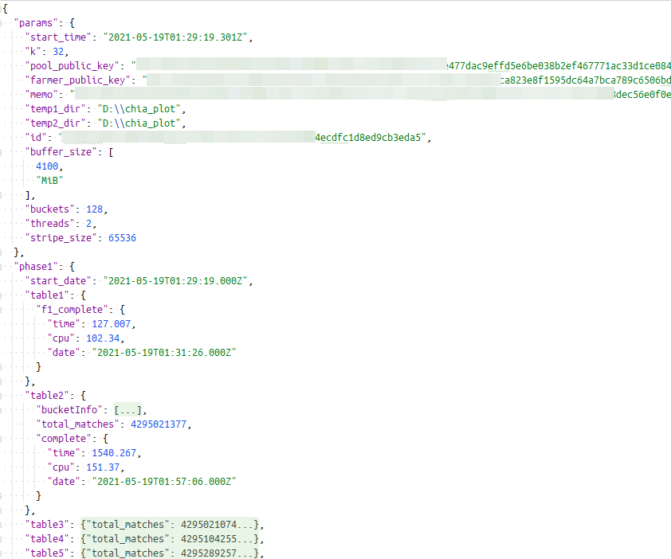
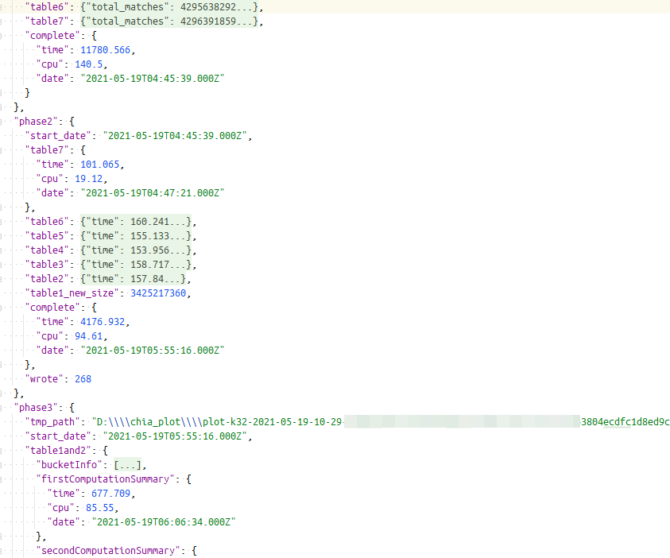
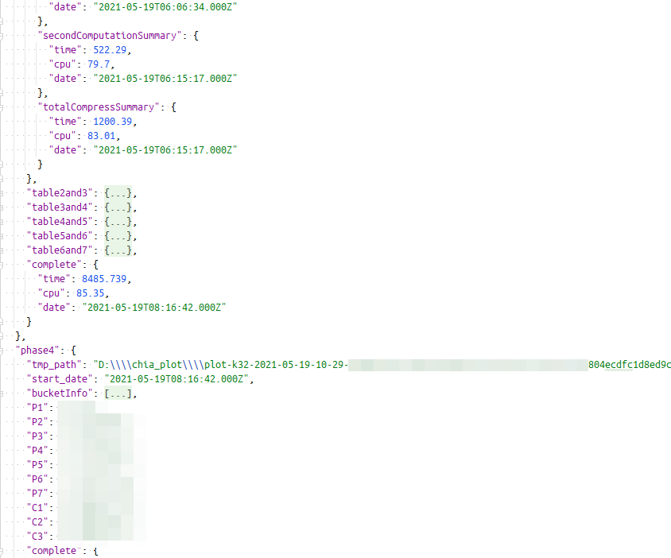
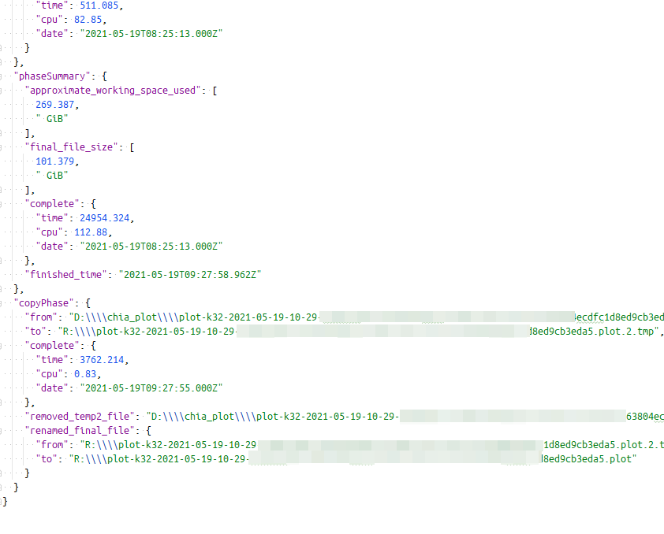

# chkplot
[](https://badge.fury.io/js/chkplot) [](https://opensource.org/licenses/MIT)

## Install
```
npm install chkplot
# or
yarn add chkplot
```

## Usage
### Command line
```
npx chkplot list [-n <N>]
    Show available plot log files.
    -n: If you specify -n 3, then top 3 of most recent plotting progress/result will be shown.

npx chkplot wip [-n <N>]
    Show plotting progress from plotter log files.
    You can specify max plotter progress to show with -n option.
    If you specify -n 10, then top 10 of most recent plotting progress will be shown.

npx chkplot summary [-u <uuid>|-n <N>|-a]
    Show plot summary.
    -u: Specify plot uuid for summary. uuid can be listed by 'npx chkplot list'
    -n: If you specify -n 3, then top 3 of most recent plotting log summary will be shown.
    -a: Show all available plot log summary
```
* If you globally install `chkplot` such as `npm install -g chkplot` or `yarn add global chkplot`,  
  you can directly run above command without `npx` command prefix.  
  
  **Example:**
  ```shell
  chkplot wip -n 10
  ```

### As a log parser
`chkplot` exposes several library function to parse/analyze plotter log.

```typescript
const {parsePlotterLog} = require("chkplot");
const log = fs.readFileSync(<path_to_plotter_log>, {encoding: "utf-8"});
const parsedLog = parsePlotterLog(log);
```
The content of `parsedLog` looks like:






## Donation
For continuous development, please support me with donation
`xch1wqpcvquv98qmeh9hg6wqpzhzmgs73lgvd8a7v5240nxgyat4p0sq4gdzyy`
